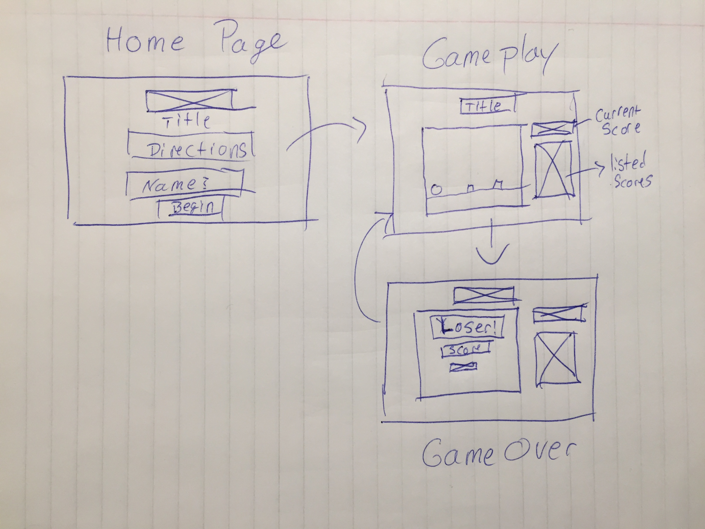

# BALL IS LIFE

Trello Link:
https://trello.com/b/iO4Hz6rx/project-1-ball-is-life

###Introduction

This will be a simple game where the player will be a ball. The ball will have one function of bouncing up and down. The reason for this action is to clear hurdles that come towards the player. 

###Approach

The gameplay space will be created using canvas. The visualization of movement for the terrain will be completed using a function that will help me manipulate the x axis to give the allussion of movement along the screen. 

I will then add a timout function to create 'blocks' that will randomly show up and move towards the player. The player will then have to time their key press to clear the hurdle. 

The longer you last, the higher your score will be. If the player makes contact with a 'block' the game will end and store there score. You will then have the option to continue gameplay. 

###Technologies Used

I will be using the languages that I have learned so far. HTML, CSS, JavaScript, jQuery, and possibly P5. 

###MVP

The MVP for my game will be a ball that a player can manipulate with a keypress to have it jump. Another aspect will be a 'block' that moves from right to left towards the player. If the 'block' and the player make contact the game will stop. 
